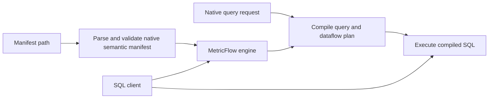

# HamiltonFlow

Complete pinned MetricFlow source, with an executable Apache Hamilton integration.
The upstream semantic parser, graph planner, optimizer, metric types and SQL
renderers are retained. Hamilton orchestrates their execution; it does not
approximate metric SQL with a replacement parser.

## What is copied

`vendor/metricflow/` contains every tracked file from upstream commit
`e2f17cbb6563f1ed90450639e51588057da0ba4e`: engine, semantic interfaces,
semantic graph, dbt integration package, documentation, fixtures and tests.
It is a full source snapshot, not the upstream Git history. Upstream code is
unmodified. `UPSTREAM.lock.json` records every file's SHA-256; run
`python scripts/verify_sources.py` to verify the copy.

`hamilton_flow/` is the new integration. Upstream licenses, attribution and
copyrights remain in place. This is an independent distribution, not an official
dbt Labs or Apache release.

## Install and run

Python 3.11 and Hatch are required (`pip install hatch` installs the build tool).
The Hatch environment installs the **bundled** MetricFlow source and this library
in a single dependency resolution. Do not install this root package alone from
PyPI: the pinned upstream development version is supplied by the checkout.

```sh
hatch run python scripts/verify_sources.py
hatch run python -c "import duckdb,pathlib; c=duckdb.connect('demo.duckdb'); c.execute(pathlib.Path('examples/setup.sql').read_text()); c.close()"
hatch run python -m hamilton_flow.cli catalog --manifest examples/semantic
hatch run python -m hamilton_flow.cli explain --manifest examples/semantic --request examples/query.json
hatch run python -m hamilton_flow.cli query --manifest examples/semantic --database demo.duckdb --request examples/query.json
hatch run test
```

The sample returns CH revenue 150, 3 orders, average order value 50; DE revenue
200, 1 order, average order value 200. The tests also execute derived metrics,
cumulative metrics, filters, time bounds, native JSON manifest loading and replay.
The setup SQL is for a new scratch database; it intentionally does not overwrite
existing tables.

## Python API

```python
import duckdb
from metricflow.engine.metricflow_engine import MetricFlowQueryRequest
from hamilton_flow import HamiltonFlow
from hamilton_flow.client import DuckDBClient

with duckdb.connect('demo.duckdb') as connection:
    flow = HamiltonFlow('examples/semantic', DuckDBClient(connection))
    request = MetricFlowQueryRequest.create(
        metric_names=['revenue', 'average_order_value'],
        group_by_names=['customer__country'],
    )
    sql = flow.explain(request).sql_statement.sql
    result = flow.query(request)
    print(result.rows)
```

Pass native `MetricFlowQueryRequest` objects for the full upstream request API.
The CLI accepts name-based JSON arguments and converts ISO time constraints.
It consumes native MetricFlow YAML directories (the upstream standalone format)
or a serialized `semantic_manifest.json`; it does not silently reinterpret a dbt
project as standalone YAML. The full `dbt-metricflow` source is included for users
who need its original dbt workflow and dependencies.

The Hamilton graph is:



`flow.driver` exposes the actual Hamilton graph. A caller owns the SQL connection;
the adapter never closes a supplied connection. CLI queries open DuckDB read-only.
Manifest definitions and filter expressions are trusted project code, as in the
upstream engine. Separate sessions/connections are required for concurrent use.

## Coverage and limits

All upstream capabilities remain available in the copied source. The added client
is tested against DuckDB; no cloud account or external warehouse was used. Other
upstream clients can be passed to the Python API, but that is not evidence that
every warehouse integration has been tested here.

See `TEST_REPORT.md` and machine-readable JUnit reports in `reports/` for actual
executions, skips and any failures. Copied tests are not counted as tests run.
The upstream dbt CLI, external warehouse suites, performance matrix and deployment
services are separate from the added Hamilton interface.

## Development

- `hatch run test`: integration tests against real DuckDB and direct MetricFlow.
- `hatch run python scripts/run_upstream_tests.py`: upstream default suites,
  executed separately because their pytest option registrations overlap.
- `hatch run ruff check hamilton_flow tests`: integration lint.
- `python scripts/verify_sources.py`: verify complete copied source content.

Edit integration code outside `vendor/`. Updating an upstream source requires an
explicit revision update and a regenerated source lock, not an unrecorded patch.

## Warehouse adapters

See [WAREHOUSES.md](WAREHOUSES.md) for Databricks, Snowflake, and ClickHouse configuration, target placement, offline validation, and execution limitations.
